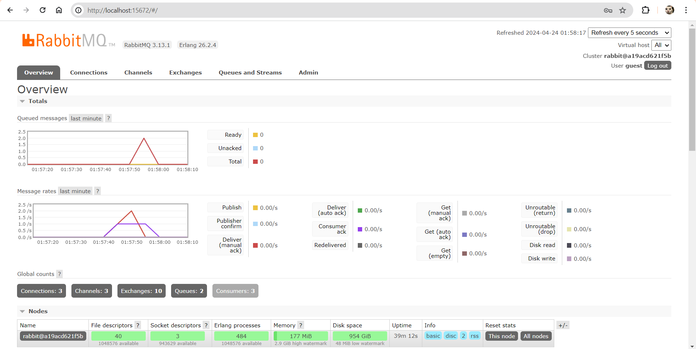
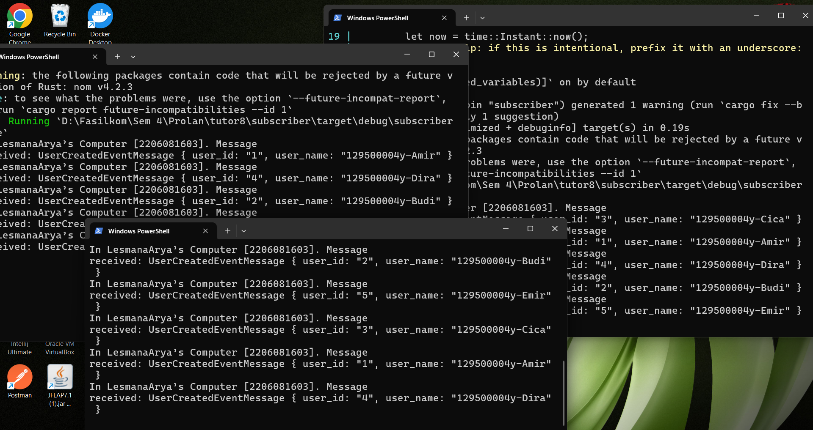

## Tutorial 8 Reflection
1. What is ampq?  
= Ampq merupakan singkatan dari Advanced Message Queuing Protocol (AMPQ) yang merupakan open-standard protocol untuk berkomunikasi seperti mengirimkan pesan atau data antar aplikasi atau komponen lain secara asinkronus  

2. What it means? guest:guest@localhost:5672 , what is the first guest, and what is
the second guest, and what is localhost:5672 is for?  
= guest:guest merupakan representasi dari username:password, jadi guest yang pertama (sebelum titik dua) adalah username dan guest yang kedua (setelah titik dua). Localhost:5672 menunjukkan IP Address dari jalannya server program. Localhost menandakan bahwa server saat ini berjalan di mesin tempat kode sedang dijalankan sedangkan 5672 merupakan port number untuk komunikasinya  

## Simulation slow Subscriber

Dengan adanya delay selama 1000 ms atau 1s, Subscriber menjadi tidak bisa langsung menerima seluruh message yang dikirim dalam waktu yang singkat. Akan ada queued messages atau message yang harus meng-antre sebelum sampai ke Subscriber karena terlalu banyak message yang dikirim ke Subscriber dalam waktu singkat sedangkan ada delay 1s pada Subcriber dalam menerima message. Saya mencoba menjalankan cargo run terus menerus di Publisher hasilnya muncul 15 queued messages pada Susbcriber. Ini yang biasa terjadi saat siak war dimana terlalu banyak request yang dikirim oleh mahasiswa daripada yang bisa diproses dalam satu waktu oleh siak sehingga server menjadi down dan harus menunggu sampai ada yang sudah selesai mengisi IRS

## Using multiple Subscriber instance

Ketika menjalankan lebih dari satu instance Subscriber, terlihat bahwa jumlah queued message menjadi lebih sedikit jika dibandingkan dengan hanya menggunakan satu Subscriber. Hal ini terjadi karena adanya distribusi message secara paralel oleh Subscriber. Jika satu subscriber sedang delay sedangkan masih ada message yang harus diterima, maka Subscriber yang tidak sedang delay dapat menerima message tersebut. Hal ini yang disebut dengan event driven, dimana event yang muncul hanya akan diproses oleh yang berminat saja tanpa menunggu apapun.